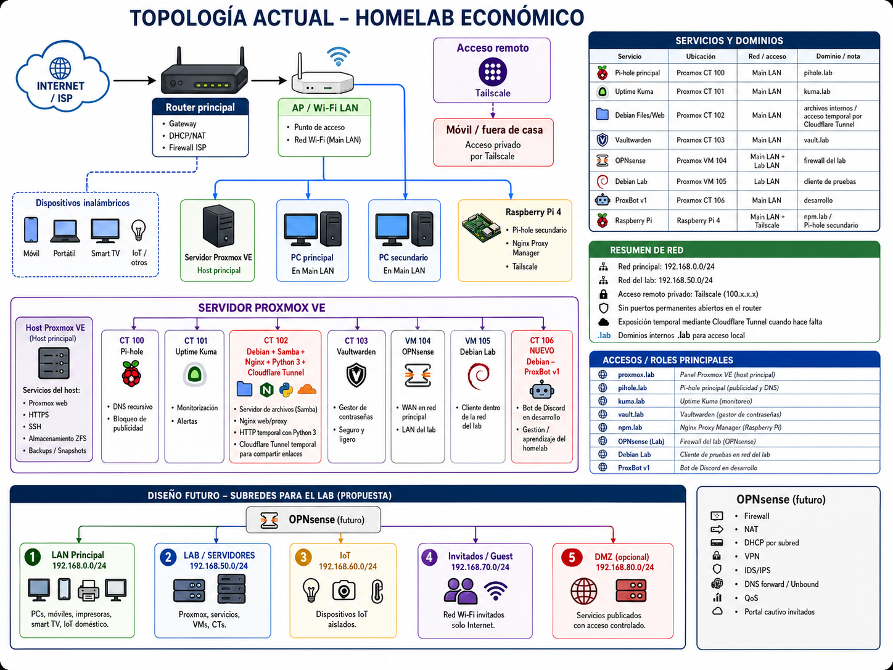

# Homelab Económico / Budget Homelab


> Proyecto personal de homelab construido con hardware reutilizado y de bajo coste, usando Proxmox VE, contenedores Linux, Raspberry Pi, DNS local, reverse proxy, monitorización, red de laboratorio y acceso remoto privado.
>
> Personal homelab project built with reused and low-cost hardware, using Proxmox VE, Linux containers, Raspberry Pi, local DNS, reverse proxy, monitoring, a dedicated lab network and private remote access.

<p align="center">
  
</p>

> [!NOTE]
> Este repositorio evita publicar credenciales reales, endpoints públicos, hostnames privados, direcciones exactas de acceso remoto o archivos de configuración sensibles.  
> El objetivo es documentar la arquitectura y el aprendizaje sin exponer el entorno.
>
> This repository intentionally avoids publishing real credentials, public endpoints, private hostnames, exact remote-access addresses or sensitive configuration files.  
> The goal is to document the architecture and learning process without exposing the environment.

## Español

### Objetivo del proyecto

Este repositorio documenta un homelab económico orientado a aprendizaje real de infraestructura, redes, virtualización, servicios self-hosted y automatización. El objetivo no es montar una infraestructura empresarial perfecta, sino construir una base mantenible, segura y práctica usando recursos accesibles.

El proyecto sirve para aprender y practicar:

- Virtualización con Proxmox VE.
- Contenedores LXC y máquinas virtuales.
- DNS local y dominios internos `.lab`.
- Reverse proxy con Nginx Proxy Manager.
- Monitorización con Uptime Kuma.
- Gestión de contraseñas con Vaultwarden.
- Firewalling y segmentación de red con OPNsense.
- Acceso remoto privado con Tailscale.
- Exposición temporal controlada mediante Cloudflare Tunnel.
- Servidor de archivos con Samba.
- Automatización y gestión mediante un bot de Discord en desarrollo.

### Principios de seguridad y privacidad

Este repositorio está pensado para ser público sin exponer datos sensibles. Por eso:

- No se publican contraseñas, usuarios reales ni correos personales.
- No se publican IPs exactas de dispositivos concretos.
- Solo se muestran rangos privados generales.
- No hay puertos permanentes abiertos en el router principal.
- El acceso remoto se realiza mediante Tailscale.
- La exposición externa se limita a túneles temporales cuando hace falta.
- Las capturas se revisan antes de publicarse para evitar filtraciones.

### Topología resumida

La red se divide en una red principal doméstica y una red de laboratorio:

| Zona | Rango público en documentación | Uso |
|---|---:|---|
| Main LAN | `192.168.0.0/24` | Dispositivos domésticos, Proxmox, Raspberry Pi y servicios principales |
| Lab LAN | `192.168.50.0/24` | Red de pruebas gestionada mediante OPNsense |
| Tailscale | `100.x.x.x` | Acceso remoto privado |

### Servicios principales

| Servicio | Ubicación | Rol |
|---|---|---|
| Proxmox VE | Host principal | Virtualización, LXC, VMs, snapshots y gestión del laboratorio |
| Pi-hole principal | CT 100 | DNS local y bloqueo de publicidad |
| Uptime Kuma | CT 101 | Monitorización y alertas |
| Debian Files/Web | CT 102 | Samba, Nginx, Python HTTP server y Cloudflare Tunnel temporal |
| Vaultwarden | CT 103 | Gestor de contraseñas self-hosted |
| OPNsense | VM 104 | Firewall del laboratorio, NAT y red separada |
| Debian Lab | VM 105 | Cliente de pruebas dentro de la red de laboratorio |
| ProxBot v1 | CT 106 | Bot de Discord en desarrollo para gestión/aprendizaje del homelab |
| Raspberry Pi 4 | Equipo externo al host Proxmox | Pi-hole secundario, Nginx Proxy Manager y Tailscale |

### CT 102: Debian Files/Web

El CT 102 es uno de los contenedores más prácticos del homelab. Su función es actuar como pequeño servidor de archivos y servidor web temporal.

Servicios actuales:

- Samba para compartir archivos en red local.
- Nginx para pruebas web/proxy internas.
- Python 3 para levantar un servidor HTTP temporal con `python3 -m http.server`.
- Cloudflare Tunnel para compartir enlaces temporales con amigos sin abrir puertos permanentes en el router.

Uso típico:

```bash
python3 -m http.server 8000
```

Después, cuando hace falta compartir algo puntualmente, se expone el servicio mediante Cloudflare Tunnel de forma temporal.

### CT 106: ProxBot v1

ProxBot v1 es un bot de Discord en desarrollo. Está pensado como proyecto de aprendizaje y como herramienta futura para consultar o gestionar partes del homelab desde Discord.

Objetivos del bot:

- Aprender automatización aplicada a un homelab real.
- Centralizar comandos útiles para el laboratorio.
- Consultar estado de servicios.
- Trabajar con configuración externa mediante `config.json`.
- Evitar hardcodear IPs, puertos, dominios o credenciales.
- Servir como base para futuras integraciones con Proxmox, monitorización o scripts internos.

### Diseño futuro

La evolución prevista del homelab es segmentar mejor la red usando OPNsense como firewall central para varias subredes:

| Subred | Rango | Propósito |
|---|---:|---|
| LAN Principal | `192.168.0.0/24` | PCs, móviles, impresoras, Smart TV e IoT doméstico |
| Lab / Servidores | `192.168.50.0/24` | Proxmox, VMs, CTs y servicios internos |
| IoT | `192.168.60.0/24` | Dispositivos IoT aislados |
| Invitados / Guest | `192.168.70.0/24` | Wi-Fi de invitados con solo Internet |
| DMZ opcional | `192.168.80.0/24` | Servicios publicados con acceso controlado |

### Documentación

- [`docs/architecture.es.md`](docs/architecture.es.md): arquitectura en español.
- [`docs/architecture.en.md`](docs/architecture.en.md): architecture overview in English.
- [`docs/services.es.md`](docs/services.es.md): servicios del homelab.
- [`docs/security.es.md`](docs/security.es.md): decisiones de seguridad y privacidad.
- [`docs/roadmap.es.md`](docs/roadmap.es.md): mejoras futuras.
- [`docs/media-checklist.es.md`](docs/media-checklist.es.md): fotos/capturas recomendadas para documentar el proyecto.

---

## Screenshots / Capturas

> Screenshots are sanitized before being published.  
> Las capturas se revisan y censuran antes de publicarse para evitar exponer datos sensibles.

### Proxmox VE summary

<p align="center">
  
</p>

### Uptime Kuma monitoring

<p align="center">
  
</p>

## English

### Project goal

This repository documents a budget-friendly homelab built to learn infrastructure, networking, virtualization, self-hosted services and automation with real hardware and practical constraints.

The goal is not to build a perfect enterprise-grade environment, but to create a safe, maintainable and useful lab using accessible hardware and open-source tools.

### Main components

- Proxmox VE as the main virtualization host.
- LXC containers for lightweight services.
- Virtual machines for network/firewall testing.
- Raspberry Pi 4 for supporting network services.
- Pi-hole for local DNS and ad blocking.
- Nginx Proxy Manager for internal `.lab` domains.
- Uptime Kuma for monitoring.
- Vaultwarden for password management.
- OPNsense for lab firewalling and network segmentation.
- Tailscale for private remote access.
- Cloudflare Tunnel for temporary external sharing.
- Samba and Python 3 HTTP server for local/temporary file sharing.
- ProxBot v1, a Discord bot under development for homelab learning and management.

### Privacy notice

This repository intentionally avoids publishing sensitive information. Exact IP addresses, usernames, credentials, e-mail addresses and private hostnames are not included. Network ranges are shown only at subnet level.
